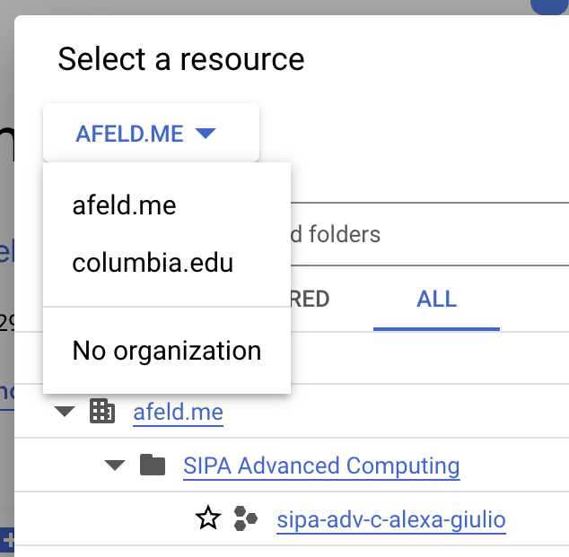

# Google Cloud

_"Project" is used to refer to both the [Google Cloud Project](https://cloud.google.com/docs/overview#projects) and the [course Project](project.md), which is admittedly confusing._

Do these one-time setup steps to ensure you don't have to pay for Google Cloud use for this class. Credits are provided through the [Google Cloud for Education](https://cloud.google.com/edu/faculty) program.

A Google Cloud Project has been created for your [team](project.md#teams), which the instructors have access to for troubleshooting. You redeem the credits, which creates a Billing Account. Someone then needs to associate their Billing Account with the existing Google Cloud Project, where the credits will be used to cover the group work.

1. [Retrieve the coupon code.](https://edstem.org/us/courses/89925/discussion/7740167)
1. [Redeem the credits](https://cloud.google.com/billing/docs/how-to/edu-grants#redeem) - [video walkthrough](https://www.youtube.com/watch?v=2AnX7BX-qew)
   1. Fill in the form.
      - Use your UNI for your email, not an [alias](https://www.cuit.columbia.edu/email/email-aliases).
   1. When you get to [the GCP Credit Application screen](https://console.cloud.google.com/education), **make sure you've [switched to your Columbia Google account](https://support.google.com/docs/answer/2405894)**.
1. [Dismiss the Free Trial banner — shouldn't need a credit card](https://services.google.com/fh/files/helpcenter/cloud_edu_free_trial_warning.pdf)
1. Confirm the credits were applied.
   1. Go to [the Billing Accounts page](https://console.cloud.google.com/billing).
   1. Click `Billing Account for Education`.
   1. In the sidebar, click `Credits`.
   1. You should see an `Advanced Computing for Policy` credit for $50.
1. Switch to your Google Cloud Project (see below).
1. One person per team: [Change the Billing Account](https://cloud.google.com/billing/docs/how-to/modify-project#how-to-change-ba) to `Billing Account for Education`.

## Switching to your Google Cloud Project

From the Console:

1. In the top navigation bar, on the left side, click the drop-down.
1. You should see a `Select a resource` modal pop up.
1. From the drop-down, you may need to switch `columbia.edu` to `afeld.me`.

   

1. Click the `ALL` tab.
1. Click `sipa-adv-c-<name1>-<name2>`.

## Accidentally redeemed the credit with the wrong Google account

If you missed the step above about switching to your Columbia Google account, the easiest fix is to follow [these steps](https://cloud.google.com/billing/docs/how-to/grant-access-to-billing#update-cloud-billing-permissions) and make your `<uni>@columbia.edu` user a `Billing Account Administrator` on the `Billing Account for Education`.

## Use of Google Cloud outside this class

If you're using Google Cloud for something outside of this group work / course, we suggest [creating a separate Google Cloud Project](https://cloud.google.com/resource-manager/docs/creating-managing-projects) to keep things isolated. The `Billing Account for Education` is yours, so you're welcome to [associate it with other Google Cloud Projects](https://cloud.google.com/billing/docs/how-to/modify-project#how-to-change-ba) to use those credits.

We won't use the full $50 credit for this class, so you're welcome to take advantage of the remainder for other things. If you use it up, you'll start spending against your [Free Trial](https://cloud.google.com/free). Beyond that, you'll have to [pay](https://cloud.google.com/billing/docs/how-to/payment-methods).
