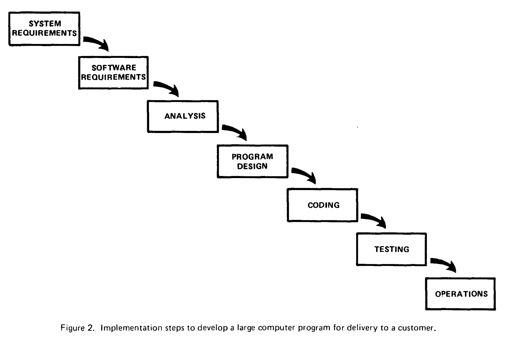

# Lecture 2: Project/product management - DRAFT

<!-- pulling from https://docs.google.com/presentation/d/1zLndDlmhzaNYz7rsK21deAEoSMilGyOdvP5LxZKZ9yw/edit -->

---

Let's say you have a big project to do — school, work, personal, whatever. How do you go about it?

_Try and avoid jargon._

---

## [Waterfall](https://en.wikipedia.org/wiki/Waterfall_model)

Royce Winston, ["Managing the Development of Large Software Systems"](https://dl.acm.org/doi/10.5555/41765.41801), 1970

---

> the implementation described above is risky and invites failure.

Why?

---

> The testing phase which occurs at the end of the development cycle is the first event for which timing, storage, input/output transfers, etc., are experienced as distinguished from analyzed.

Why is that a problem?

---

> These phenomena are not precisely analyzable. … if these phenomena fail to satisfy the various external constraints, then invariably a major redesign is required. A simple … patch or redo of some isolated code will not fix these kinds of difficulties.

Why is that a problem?

---

> The required design changes are likely to be so disruptive that the software requirements upon which the design is based and which provides the rationale for everything are violated. Either the requirements must be modified, or a substantial change in the design is required. In effect the development process has returned to the origin and one can expect up to a 100-percent overrun in schedule and/or costs.

---

_Hop to [Human-Centered DevOps](https://speakerdeck.com/aidanfeldman/human-centered-devops?slide=8), slides 8-16_

---

[source](https://asana.com/resources/agile-methodology)

---

Why would circular vs. linear help?

---

> Responding to change over following a plan

[Manifesto for Agile Software Development](https://agilemanifesto.org/)

---

## Continuous delivery

---

Benefits app

---

> Plans are worthless, but planning is everything.

[Dwight D. Eisenhower](https://quoteinvestigator.com/2017/11/18/planning/)

---

Per [syllabus](../README.md#course-description):

> Over the semester, students will build a complex end-to-end data system.

What might we need?
