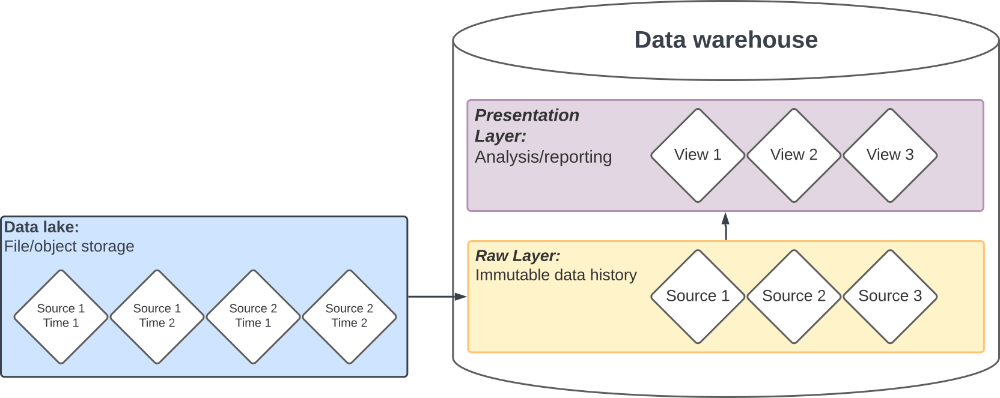

# Lecture 11

**Data engineering, continued**

---

We're going to revisit a number of concepts from earlier.

---

What can go wrong in data loading/manipulation? What errors/bugs have you hit?

---

What would you want to happen?

---

## Failure modes

- Graceful degredation
- Examples?

---

## Process mapping

---

### DAGs

**Directed acyclic graphs**

What does that mean?

---

## Data processing

- Pipelines
  - Modeled as a DAG
- Jobs
- Batch vs. streaming
- Online vs. offline
- [Online transaction processing (OLTP)](https://en.wikipedia.org/wiki/Online_transaction_processing)
- [Online analytical processing (OLAP)](https://en.wikipedia.org/wiki/Online_analytical_processing)

---

## Pipelines

- Useful for complex [ETL](lecture_10.md#overview)
- Dependencies
- Assets
- Data
- Code (continuous integration/deployment)

---

### GitHub Actions configuration

- [Examples](../.github/workflows/)
- [Trigger configuration](https://docs.github.com/en/actions/writing-workflows/workflow-syntax-for-github-actions#on)

---

## Persistence

Why store the data?

---

## Data lake/warehouse

<!-- https://lucid.app/lucidchart/3a04cf05-06b1-4a79-a2f5-b72314f0d46e/edit --->

---

### [Example view](lecture_08.md#retrieving-the-latest-load)

---

## GitHub Actions for ETL

---

There are _many_ [alternative data integration / workflow orchestration tools](https://www.pracdata.io/p/open-source-data-engineering-landscape-2025).

---

## [Project Part 6](../docs/project.md#part-6)

---

## [Readings](../readings/week_12.md)

They're heavy this week, don't wait!
