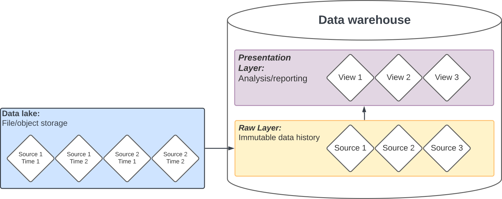

# Lecture 11

**Data engineering, continued**

---

## [Page load times](../labs/lab_10.md#performance)

- Clarify the intent
- Added profiling option
  - Demo

---

### [Caching demo](../examples/caching.py)

---

We're going to revisit a number of concepts from earlier.

---

What can go wrong in data loading/manipulation? What errors/bugs have you hit?

---

What would you want to happen?

---

## Failure modes

- Graceful degredation
- Examples?

---

## ETL

What is it?

---

What ETL is going on in your apps?

---

### ETL vs. [CI](../labs/lab_06.md#continuous-integration)

---

## Process mapping

---

### DAGs

**Directed acyclic graphs**

What does that mean?

---

## Data processing

- Pipelines
  - Modeled as a DAG
- Jobs
- Batch vs. streaming
- Online vs. offline
- [Online transaction processing (OLTP)](https://en.wikipedia.org/wiki/Online_transaction_processing)
- [Online analytical processing (OLAP)](https://en.wikipedia.org/wiki/Online_analytical_processing)

---

## Pipelines

- Useful for complex ETL
- Dependencies
- Assets
- Data
- Code (continuous integration/deployment)

---

### GitHub Actions configuration

- [Examples](../.github/workflows/)
- [Trigger configuration](https://docs.github.com/en/actions/writing-workflows/workflow-syntax-for-github-actions#on)

---

## Persistence

Why store the data?

---

## Data lake/warehouse

<!-- https://lucid.app/lucidchart/3a04cf05-06b1-4a79-a2f5-b72314f0d46e/edit --->

---

### [Example view](lecture_08.md#retrieving-the-latest-load)

---

## GitHub Actions for ETL

GitHub Actions ➡️ Python ➡️ BigQuery

---

There are _many_ [alternative data integration / workflow orchestration tools](https://www.pracdata.io/p/open-source-data-engineering-landscape-2025).

---

## [Project Part 6](../docs/project.md#part-6)

---

## [Readings](../readings/week_12.md)

They're heavy this week, don't wait!

---

## [Open Data Week Reflections](https://edstem.org/us/courses/89925/discussion/7808867)

### From Connectivity to Connection, Transforming Digital Equity Into Action 
- Focused on the digital divide in NYC. The panel included speakers from BetaNYC, New York State Government, New York City Office of Technology and Innovation, and Council Member Jennifer Gutiérrez. 
- I was actually quite surprised to find out that there is still a significant digital divide in New York City, especially in certain community districts. While availability (i.e. access to the internet) is relatively high, adoption is lagging. In the Bronx, for example, **40% of households lack broadband internet subscriptions** and rely on mobile data for their internet access. 
- One of the panelists highlighted how these sorts of geographical data have been helpful for NYC policymakers to make inferences about digital equity in NYC. I also came across the term **"digital deserts"** for the first time during the talk, and it sounded like it could be an interesting project topic (maybe in the future).

---

### Improving Bus Speeds in NYC

- This event showed how difficult it is to turn policies into actual results. While the city has expanded bus lanes and introduced things like Streets Plan, the **average bus speed has remained relatively unchanged** because of things like congestion, enforcement, etc.

---

### {echo}logies’ Data Through Design
- Gave me an interesting perspective on how **data can be transformed into a beautiful display of physical contemporary art**, offering a different outcome from what we typically create in class or during data analytics work.
- For instance, an installation that transforms NYC **sanitation data into vinyl records** has a more subliminal meaning (as most other modern art forms do) compared to typical data analytics outputs. This approach is genuinely fascinating, as the data is transformed into something physical that implies a certain meaning, yet still remains exquisite.

---

## [Reading response questions](https://edstem.org/us/courses/89925/discussion/7869413)

### Performance

- I wonder if there effectively a “library” of such **UX tricks for perceived performance**? And also where is the **line between good design and deception**? Some techniques seem clearly helpful. But there is also a point at which these same strategies could become manipulative. A fake progress bar, a misleading animation, or a reasoning trace that implies more transparency than actually exists might reassure the user while obscuring what the system is truly doing.
- I am curious if it would make sense to display these times to the users serving as an **explanation as to why the code is loading slowly..**? Or would it be better to have a loading bar or something more user friendly?
- If caching is used to improve performance, does that mean **optimizing the experience for first-time users**—who cannot benefit from cached results—is inherently more difficult?
