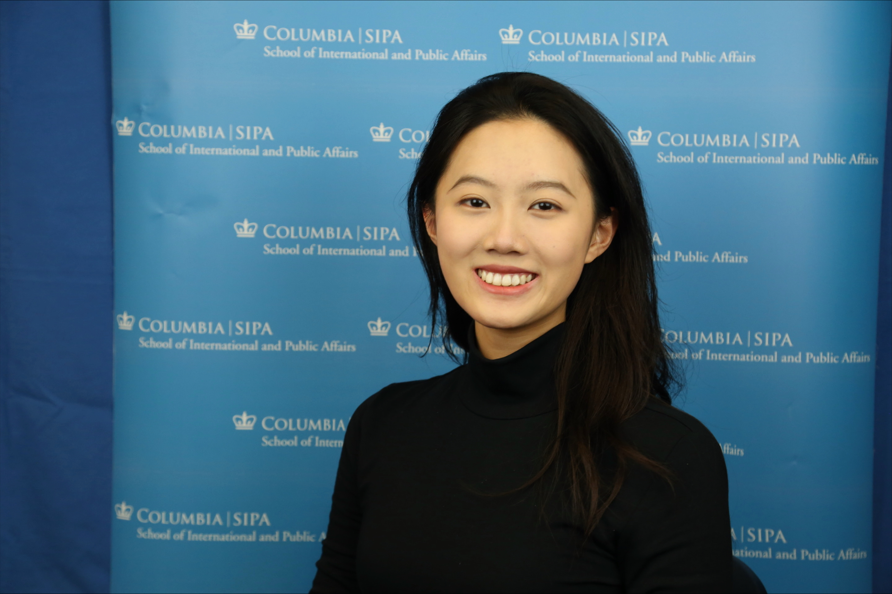

# Jinen (Gina) Wang

**Program:** MPA

**Concentration/minor:** IFEP/DSP

**Background:** Accounting, Artificial Intelligence

**Why are you in this class? Do you have a dream project/job?**

I'm attending this class because I want to know more about basic computer science.

One dream job is working on tackling complex global problems through tech-enabled solutions.

**Favorite snack:** AMOS peelerz Candy

