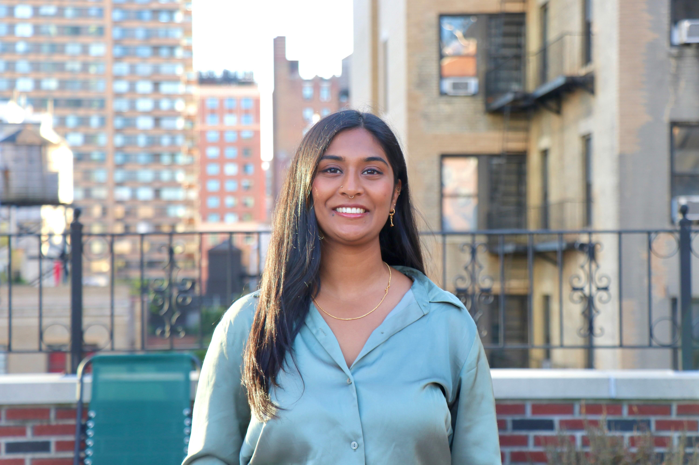

# Sneha Palle

**Program:** Master of Public Administration (MPA)

**Concentration/minor:** Climate & Energy; Tech Policy

**Background:** Software engineering, tech policy, climate change / sustainability, political science

**Why are you in this class? Do you have a dream project/job?**

I'm teaching this class because I love helping people learn about coding/engineering. I think it's a skill everyone should have (regardless of what all the AI existentialists say), and extremely important to close the digital literacy gap. So it's really gratifying to see people figure it out :) (Also I need money for grad school lol.)

One dream job is working on national or state tech regulation policies - specifically with respect to antitrust, AI, and privacy.

**Favorite snack:** Unfortunately, potato chips

